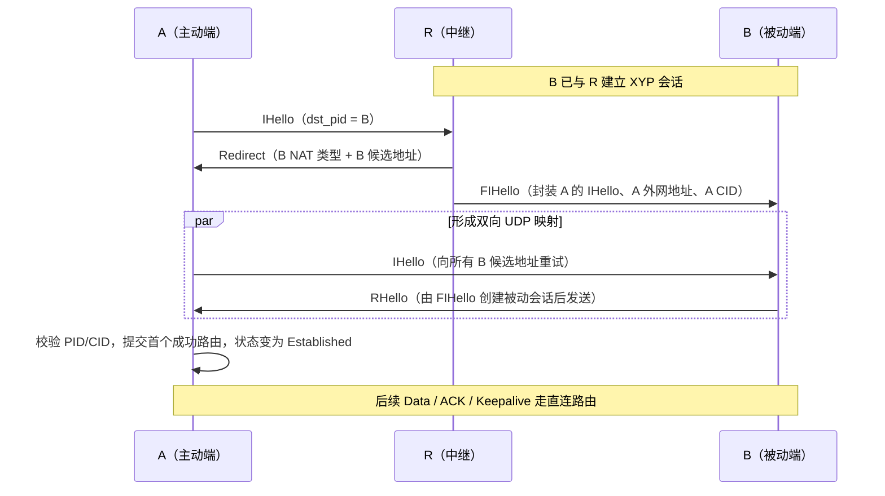

# XYP UDP 打洞建连流程

本文依据当前 XYP 实现整理，描述两个端点通过已在线的中继节点建立直连 UDP 会话的过程。XYP 的打洞信令复用 XYP/UDP 报文，不依赖独立的控制信道。

## 1. 参与方与前置条件

| 角色 | 职责 |
| --- | --- |
| A（主动端） | 请求与目标 `pid` 建连，接收候选地址后主动发送 `IHello`。 |
| B（被动端） | 已经通过 XYP 与 R 保持会话；收到 `FIHello` 后创建被动会话，并向 A 回 `RHello`。 |
| R（中继/已在线节点） | 按目标 `pid` 找到 B 的已建立会话，向 A 返回 B 的候选地址，并将 A 的首个握手转交给 B。 |
| N（NAT 探测服务） | 识别 UDP 外网映射地址及 NAT 类型；默认服务见 `README.md`。 |

前置条件：

1. 各端先在 `Context` 上绑定 UDP socket；同一个 socket 既用于 NAT 探测，也用于后续会话。
2. A 与 B 应已完成对应 IP 协议族的 `NatDetect`，应用从 `kNat4` 或 `kNat6` 信号取得外网地址与 NAT 类型。
3. B 到 R 的 XYP 会话处于 `Established`，使 R 能按 B 的 `pid` 查到该被动会话。
4. A 知道目标 B 的 `pid`，并至少有 R 的可达地址作为初始 `ConnectParams.addr`。

## 2. NAT 探测

NAT 探测从 N 的原始地址开始；N 返回观察到的外网地址及可切换的服务地址。客户端按响应与超时继续探测原始地址、变更地址和变更端口，最终上报以下类型之一：

`OpenPublic`、`OpenPublicWithFirewall`、`FullCone`、`IPRestricted`、`PortRestricted`、`SymmetricChangePort`、`SymmetricChangeLine` 或 `Unknown`。

当前代码默认每次探测超时为 300 ms、最多重试 3 次。探测失败不会阻止调用 `Connect`，但 NAT 类型会是 `Unknown`，候选地址和端口预测的有效性会下降。

## 3. 主流程

具体步骤如下：

1. A 调用 `Context::Connect`。主动会话进入 `IHelloSent`，在初始地址 R 上发送 `IHello`；报文包含 A 的 `pid`、本端 NAT 类型、连接 CID、目标 `pid`、I/O 模式和可选首段业务消息。
2. R 收到 `IHello` 后按目标 `pid` 找到 B 的被动会话。若未找到且未配置重定向处理器，R 回 `EHello`；若找到，R 同时执行两件事：
   - 向 A 返回 `Redirect`：包含 B 的 NAT 类型、B 当前外网地址，以及辅助候选地址或预测端口。
   - 沿 B 与 R 的既有会话发送 `FIHello`：其中封装 A 的 `IHello`、A 的源地址和 A 的 CID。
3. A 收到 `Redirect` 后，将 B 的候选地址加入握手地址集合；默认过滤私网地址。随后立即向集合中的每个地址周期性发送 `IHello`。用于 R 的地址被加入 `message_omit_addr`，避免把首段业务消息发给中继。
4. B 收到 `FIHello` 后，以封装的 `IHello` 在本地创建被动会话；被动会话记录 A 的 `pid`、CID、NAT 类型和地址，然后直接向 A 发送 `RHello`。该出站 UDP 报文创建 B 到 A 的 NAT 映射。
5. A 的 `IHello` 到达 B，或 B 的 `RHello` 到达 A，即可穿透双方 NAT。A 校验响应中的源/目的 `pid`，保存 B 的 CID 和 NAT 类型，提交收到报文的 route，停止握手定时器并进入 `Established`；随后触发 `Connection::Signal::kConnected`。
6. A、B 后续通过已提交的 route 收发数据。保活定时器维持 NAT 映射；网络变化时，仅目标为 `FullCone` 及以下类型的主动会话会触发地址更新。

## 4. 对称 NAT 与端口预测

当一端为 `PortRestricted`（或 `OpenPublicWithFirewall`），另一端为 `SymmetricChangePort` 或 `SymmetricChangeLine` 时，单一映射地址不足以建连：

1. 位于 R 后的 B 会通过 `UpdateAddr(kPortPrediction)` 将其观察到的外网端口持续上报给 R。
2. R 对同一公网 IP 的端口样本计算递增规律；可信度达到阈值时生成下一个可能端口，否则生成随机候选端口。
3. R 在 `Redirect` 中返回 B 的实际地址和预测地址集合。
4. A 向全部候选地址发 `IHello`；如果 A 本身是对称 NAT，则每轮握手前申请新的本地 UDP route，以尝试不同的出站映射端口。
5. B 收到 `FIHello` 时也会根据 A 的端口样本修正 A 地址，再发送 `RHello`。

端口预测是提高成功率的启发式机制，不保证能够穿透所有对称 NAT。预测地址应仅在本次握手窗口内使用，并受 `MaxRouteNumber`、重试次数和总体超时约束。

## 5. 示例：端口限制型与端口限制型

假设 A、B 都是端口限制型 NAT，R 为公网中继。端口限制型的特征是：公网映射端口稳定，但 NAT 仅接受此前本端已经发送过报文的目标 `IP:port` 返回的数据。

| 节点 | 本地 UDP 地址 | 本次映射后的公网地址 |
| --- | --- | --- |
| A | `10.10.0.8:50000` | `203.0.113.8:40000` |
| B | `192.168.1.9:52000` | `198.51.100.9:62000` |
| R | `198.51.100.20:6935` | 公网地址，无 NAT |

建连时序如下：

1. B 已经从 `198.51.100.9:62000` 与 R 建立会话；R 因而保存 B 的 `pid`、NAT 类型和可回包地址。
2. A 从 `203.0.113.8:40000` 向 R 发 `IHello(dst_pid=B)`。这只放行 A <-> R，不会放行 B 的地址。
3. R 向 A 发送 `Redirect(addr=198.51.100.9:62000, nat=PortRestricted)`，并向 B 的既有会话发送 `FIHello(src_addr=203.0.113.8:40000)`。
4. A 收到 `Redirect` 后，立即从 `203.0.113.8:40000` 向 `198.51.100.9:62000` 发送 `IHello`。A 的 NAT 因而允许该 B 地址回包。
5. B 收到 `FIHello` 后创建被动会话，并从 `198.51.100.9:62000` 向 `203.0.113.8:40000` 发 `RHello`。B 的 NAT 也因此允许该 A 地址回包。
6. A 收到 `RHello` 后校验 PID/CID，进入 `Established`。即使 A 的直连 `IHello` 与 B 的 `RHello` 在网络中交叉，也不影响建连；两端的出站报文已经先后建立了相互允许的过滤规则。

若第 4 步没有发生，B 的 `RHello` 通常会被 A 的端口限制型 NAT 丢弃；若第 5 步没有发生，A 的 `IHello` 通常会被 B 的端口限制型 NAT 丢弃。因此该类型必须让双方都向对方候选地址发包，而不能只依赖 R 转交握手。

## 6. NAT 组合与 RTT

下面的 RTT 是网络时延模型，不是 XYP 在握手阶段写入的统计值：

- `RTT_AR`：A 到 R 的往返时延。
- `RTT_AB`：A 到 B 的直连往返时延。
- "理想建连时延"假设候选地址正确、无丢包、事件循环没有排队延迟。

`IHello -> RHello` 是一次完整的直连握手往返，即约 `1 x RTT_AB`。获得候选地址需要约 `1 x RTT_AR`；R 向 B 转发 `FIHello` 与 R 向 A 返回 `Redirect` 并行执行。对于 A 存在地址/端口过滤的场景，A 必须先收到 `Redirect` 并向 B 发包，因此常用估算为：

`T_connect ~= RTT_AR + RTT_AB`

| A 的 NAT 类型 | B 的 NAT 类型 | 直连策略 | 理想建连时延 | 额外等待风险 |
| --- | --- | --- | --- | --- |
| `OpenPublic` / `FullCone` | 公开、全锥、受限或对称 | B 收到 `FIHello` 后可直接向 A 回 `RHello`；A 同时也会在收到 `Redirect` 后发 `IHello`。 | 通常不大于 `RTT_AR + RTT_AB`；若 B 的 `RHello` 先到，约为 `0.5*RTT_AR + 0.5*RTT_RB + 0.5*RTT_AB`。 | 低；B 为对称 NAT 时仍依赖其出站 `RHello` 创建的瞬时映射。 |
| `IPRestricted` / `PortRestricted` | `OpenPublic` / `FullCone` / `IPRestricted` / `PortRestricted` | A 收到 `Redirect` 后向 B 发 `IHello`，B 回 `RHello`；双方各自先放行对方地址。 | `RTT_AR + RTT_AB`。 | 低至中；候选地址过期或丢包时，等下一次握手重传。 |
| `PortRestricted` / `OpenPublicWithFirewall` | `SymmetricChangePort` / `SymmetricChangeLine` | R 依据 B 上报的端口样本，在 `Redirect` 中给出实际地址加预测端口；A 对所有候选地址并发发送 `IHello`。 | 预测命中时为 `RTT_AR + RTT_AB`。 | 预测未命中时，每次握手轮次额外约 200 ms；候选端口在同一轮并发，不是逐个多等一个 RTT。 |
| `SymmetricChangePort` / `SymmetricChangeLine` | `PortRestricted` / `OpenPublicWithFirewall` | A 每轮 `IHello` 前更换本地 UDP route，以产生新的出站映射；B 从 `FIHello` 推测 A 的端口并先发 `RHello`。 | 预测命中时为 `RTT_AR + RTT_AB`。 | 中至高；每个未命中轮次额外约 200 ms，并消耗一个 route。 |
| `SymmetricChangePort` / `SymmetricChangeLine` | `SymmetricChangePort` / `SymmetricChangeLine` | 当前代码没有专门的双对称 NAT 协调/预测分支。 | 无可保证的 RTT 上界。 | 高；应尽早降级到中继、TCP 或其他可达传输。 |

其中 `RTT_RB` 是 R 到 B 的往返时延。第一行的更短路径只适用于 A 没有过滤入站地址时：R 的 `FIHello` 到达 B 后，B 可立即回 `RHello`，A 不必等待 `Redirect` 才能接收该包。其他行中，A 必须先向 B 发送报文以放行回包，故不能采用这个下界。

当前实现的主动握手定时器为每 200 ms 一轮、最多 100 轮；实际耗时可近似为：

`T_actual ~= T_connect + 未命中轮次数 * 200 ms + 排队/丢包恢复时间`

会话的 `rtt_latest`、`rtt_smo` 等指标并不是由 `IHello/RHello` 计算，而是在建连后由保活 `Ping/Pong` 或 `FullReliable` 数据与 ACK 的往返时间更新。因此，排障时应分别记录“连接建立耗时”和“建立后的会话 RTT”，不要用后者反推前者。

## 7. 报文与状态

| 报文 | 方向 | 用途 |
| --- | --- | --- |
| `NatRequest` / `NatResponse` | 端点 <-> N | 探测外网映射和 NAT 类型。 |
| `IHello` | A -> R 或 A -> B | 发起握手；目标为 B 时即为实际打洞包。 |
| `Redirect` | R -> A | 下发 B 的 NAT 类型和候选地址。 |
| `FIHello` | R -> B | 通过既有会话转发 A 的首个握手及其可回包地址。 |
| `RHello` | B -> A | 被动端确认握手，同时形成反向 UDP 映射。 |
| `EHello` | R -> A | 目标不存在或无法转发。 |
| `UpdateAddr` / `UpdateAddrAck` | B <-> R | 更新辅助地址或对称 NAT 的端口预测样本。 |

主动会话状态为：`Init -> IHelloSent -> Established`。被动会话在接收 `IHello` 或经 `FIHello` 还原出的 `IHello` 后，从 `Init` 进入 `Established`。CID 不匹配时发送 `Reset(kCIDInvalid)`，未知目的 CID 时发送 `Reset(kDCIDMiss)`。

## 8. 超时与失败处理

1. 主动端按 `ActiveHandshakeTimeout` 重发 `IHello`，超过 `ActiveHandshakeRetries` 或 `ConnectParams.timeout` 后以 `kConnectTimeout` 失败。
2. 收到 `EHello` 时移除该地址；地址集合为空则以 `kNoConnectAddr` 失败。
3. `Redirect` 中的候选地址必须初始化且协议族一致；默认不采纳私网候选地址，除非 `use_private_address` 为 `true`。
4. 直连失败时，当前实现不会自动把数据降级为经 R 转发；上层应改用可用的中继/TCP 方案或重新发起连接。

## 9. 实现入口

| 关注点 | 代码位置 |
| --- | --- |
| NAT 探测状态机 | `src/nat/xyp_nat_client.cpp` |
| UDP 分发、接收 `IHello`、创建被动会话 | `src/context/xyp_context.cpp` |
| 主动握手与重试 | `src/session/active/xyp_session_handshake.cpp` |
| R 的重定向与 `FIHello` 转发 | `src/session/passive/xyp_session_relay.cpp` |
| 被动端接受及 `RHello` | `src/session/passive/xyp_session_accept.cpp` |
| 对称 NAT 的端口预测 | `src/session/xyp_port_prediction.cpp` |
